# Skavtko v2.0

## Osnovni podatki

### Člani skupine

Št. skupine: 01
Peter Rovtar
Peter Šavron

### Github povezava

https://github.com/provtar/PRPO-Skavtek
IP naslov zaledja

## Kratek opis

Oba sva skavtska voditelja. Pri izbiri teme smo pomislili na potrebe skavtske organizacije. Cilj projekta je sestaviti mikrostoritve, ki se bodo integrirale z mobilno aplikacijo, ki olajša administrativno upravljanje srečanj preko beleženja prisotnosti članov ter pomaga pri iskanju terminov preko mikrostoritve, ki omogoča članom izbrati termine, ko so na razpolago.

## Ogrodje in razvojno okolje

Uporabljali bomo IDE Visual Studio Code in dodatke, ki so na voljo, da olajšajo programiranje v Javi, typescriptu, pa drugih jezikih, ki jih bomo uporabljali.
Naš build tool bo Maven, spodaj prilagamo seznam odvisnosti, ki smo jih vključili v projekt:
* kumuluzee-bom: za usklajevanje verzij osnovnih kumuluzee gradnikov;
* kumuluzee-openapi: za ustvarjanje openapi dokumentacije preko anotacij znaotraj kode
* kumuluzee-openapi-ui: za izdelavo grafičnega vmesnika z dostop do openapi dokumentacije
* kumuluzee-ee: za razrešitev CORS zahtev brskalnikov
* kumuluzee-streaming-kafka: za uporabo sporočilnega sistema Kafka, ki bistveno olajša komunikacijo med mikrostoritvami
* postgresql: za dostop do podatkovne baze
* HikariCP: za upravljanje bazena povezav do podatkovne baze
* hibernate-hikaricp: kotimplementacijo JPA specifikacij za objektno relacijsko mapiranje (ORM)
* gson: za serializacijo in deserializacijo objektov, ki se pošiljajo preko Kafka sporočilnega sistema, da se izognemo težavam s konfiguracijo standardnih serializatorjev
* jackson-datatype-jsr310: za serializacijo javanskiega LocalDateTime formata;
Kot že povedano smo za razvoj mikrostoritev uporabljali kumuluzee enostavno, v Sloveniji razvito ogrodje, ki omogoča hitro integracijo gradnikov za razvoj modernih, skalabilnih mikrostoritev.
### Gradnja slik
Gradnjo slik smo izvedli v Dockerju, mikrostoritve se poženejo na openjdk sliki, pri tem se slike za lokalno in produkcijsko okolje razlikujejo, namreč v lokalnem okolju, dodajamo plasti nad sliko openjdk:17-alpine, ki podpira samo x86 procesorje, medtem ko v oblačnih storitvah uporabljamo openjdk:17-slim, zgrajeno za ARM64 procesorje. Slika za kafko je apache/kafka:latest.
Docker smo uporabljali tudi za lokalno integracijo in testiranje slik, vse mikrostoritve smo lahko naenkrat pognali z docker-compose datoteko.
### Namestitev v gruče
Naš ponudnik oblačnih storitev je Oracle, ki ima določene omejitve za poskusne račune, namreč ne dovoljuje več kot 3 porazdelilce obremenitve na poskusni račun, zato smo uporabili Ingress preslikovalno tabelo, ki usmerja zahteve na port 80 na različne mikrostoritve glede na pot http zahtevka. Usmerjanje opravlja storitev traefik:v2.9. Na gručo je tudi nameščen Kafka sporočilni sistem.
### Grafični vmesnik
Je razvit v Angularju, iygled elementov je oblikovan v CSS-ju. Http zahtevke pošiljamo na zaledje s pomočjo HttpClient knjižnice, znotraj komponent pa uporabljamo še ReactiveFormsModule in CommonModule. Frontend trenutno ni nameščen v oblak.
###  Oblačne storitve:
Kubernetes gruča je nameščena na Oraclu, ima 2 vozlišči, in en sam porazdelilec obramenitve, kar zmanjša stroške. Podatkovno bazo nudi supabase, ki je gostovan na AWS strežnikih. Oba strežnika se nahajata v srednji Evropi, zato komunikacija med njima poteka hitro.

## Zahteve
### Repozitorij
Je dostopen na GitHubu (https://github.com/provtar/PRPO-Skavtek), razvoj je potekal na veji dev in njenih sinovih. V datoteki readMe so razni zagoni za v ukazno vrstico.
### Razvojno okolje
Bolj obširno je razloženo zgoraj, datotečni sistem je razdeljen na frontend, ki se še razveji v storitve (za povezavo do zaledja) in komponente, ki se delijo po namenu: skrita okna, seznami, ogrodje spletne strani in obrazci.
Vsaka mikrostoritev je v svoji mapi, ima svoj maven projekt s tremi moduli: api za implementacijo REST API-ja, storitve za vso poslovno logiko in entitete za ustvarjanje entitetnih preslikav.
### REST API
Vsaka mikrostoritev ima podprtih le toliko klicev, kolikor jih je potrebnih za njeno izvajanje. Storitev skupine ima tako končne točke za delo s skupinami, kot končne točke za upravljanje s člani.
Ob uspehu vračajo storitve 200, delete metode 204, post metode pa 201. Iskanje po identifikatorju vrne 404, če entiteta se ni našla.
### Dokumentacija
API je dostopna v grafični obliki na strežnikih.
### Vsebniki
Lokalno jih lahko zaganjamo z ukazom java -ja, z docker run, preko docker compos-a, pa preko namestitve na docker desktop kubernetes gručo. Namestitvi storitve Osebno spremljanje sledi HPA, ki lahko skalira pode do 5 replik. Ker je število dovoljenih LoadBalancerjev omejeno, implementiram en sam LoadBalancer, ki se poveže na Ingress preslikovalno tabelo, ki na podlagi končnic URL naslovov poda zahtevo na port, ki jih storittve ClusterIp izpostavijo.
### Namestitev v oblak
Docker slike so hranjene na zasebnem docker registru, so katerih se dostopa s skrivnim kljucem. Zaledje je dostopno na IP naslovu 89.168.78.91:80 .
### Poslovna logika
Čeprav vse storitve dostopajo do iste podatkovne baze, dostopa vsaka le do svojih tabel. Nekatere tabele so podvojene, da se lahko hitreje do njih dostopa, vsebujejo pa le najvažnejše atribute, če tabela Clan vsebuje ime, priimek, steg, skavtsko ime, id, elektronski naslov, vsebujejo tabele clanov drugih mikrostoritev samo id, ime, priimek in steg.
Samo storitev Prisotnosti požene poizvedbo, da odkrije člane skupine in da nastavi vrednost polja beleženja entitete srečanja na pozitivno.
### Dokumentacija
Navodila za pogon in nameščanje so dostopna na v readMiju, dokumentaacija API-jev pa na posameznih strežnikih. Okoljske spremenljivke so hranjene v skrivnostih kubectl-ja, tako podatki za dostop do podatkovne baze kot za dostop do Oracle repozitorija. Persistence.xml je nastavljen tako, da ob novem pogonu samo posodobi strukturo tabel, če je potrebno.
### Zunanji API
Ko vračamo podatke o srečanju, mu dodamo še podatke o vremenu, do podatko dostopamo na naslovu https://api.open-meteo.com/v1/forecast za dostop do tega API-ja ni podrebno nobenih API ključev. API parametre o vremenu za poljubno lokacijo.
### Podatkovna baza
Uporabljamo Postgres podatkovno bazo, nameščeno na AWS cloud, nam jo pa ponuja posrednik Supabase (https://supabase.com/). Vse tabele se nahajajo v istem projektu, vsaka storitev je odgovorna za to, da dostopa le do svojih tabel. Za usklajevanje podatkov med tabelami pa je odgovoren sporočilni sistem Kafka.
Dostop do nje ureja persistence.xml, datoteka, v katero se prepiše nekaj okoljskih spremenljivk. Za lokalni zagon smo na Dockerju pognali sliko postgresa v vsebniku.

### ORM
Za dostop do in upravljanje podatkovne baze uporabljamo Hibernate, pri tem pa v storitvah uporabljamo le orodja, ki jih podpira JPA specifikacija, torej EntitzManagerje pa njihove funkcionalnosti, tudi poizvedbe so pisane v JPQL jeziku in shranjene v entitetah z anotacijami @NamedQuery.
### Preverjanje zdravja
Vsak strok ima izpostavljeno pot /v1/ime-poda/liveness na kateri preverjamo stanje stroka. Ob klicu se izvede metoda, ki zahtevo, da zrno vloženo v storitev pošlje enodtavno poizvedbo v podatkovno bazo. Zdravje se preverja vsakih 10 sekund.
### Skaliranje
Pognano imamo HPA storitev, da po potrebi poveča število podov. Da storitev dela, potrebujemo metrics strežnik, ki sledi uporabi virov posameznih strokov. Podatke dobimo z ukazom kubectl top pods. Za demonstracijo uporabimo endpoint v1/osebno-spremljanje/panic, ki ustvari veli array in ga skuša preko Collections.shuffle metode urediti po vrstnem redu.
### Grafični vmesnik
Imamo preprost grafični vmesnik, preko katerega lahko prikažemo in upravljamo naše podatke. Napisan je v Angularjo, grafični del je v zelo preprostem css-u.
### BONUS: Uporaba sporočilnega sistema Kafka
Imamo devet tem (topic) na katere se lahko mikrostoritev priklopi, če želi dobivati podatke o drugih entitetah. V primeru storitve clani, ob vsaki posodobitvi, stvaritvi ali brisanju člana se požene sporočilo na pravo temo (clani-post, clani-put, clani-delete). Ostale storitve preko dodatnega razreda, ki se ga lahko preprosto vstavi v modul poslušajo temam Kafke.

## Shema arhitekture

## Mikrostoritve

### 1 - Upravljanje članov

* Registracija uporabnikov
* Posodabljenje podatkov in pravic uporabnikov
* Vpis v storitev
* Dostop do podatkov drugih uporabnikov

### 2 - Delovne skupine

* Dodeljevanje skupin članom
* Posodabljanje skupin
* Dostop do podatkov o skupini

### 3 - Beleženje prisotnosti

- Pridobivanje prisotnosti clanov na enem srečanju
- Pridobivanje prisotnosti člana skozi časovno obdobje
- Priodobivanje prisotnosti za vsa srečanje skupine (v časovnem intervalu)
- Pridobivanje statistike za skupino (kolkokrat vsak prisoten odsoten)
- Dodatne analize po potrebi
- Dodajanje prisotnosti na srečanju (trenutno za vse, se da status ni bilo namenjeno njemu - siv)
- Posodabljanje posameznih prisotnosti
- Brisanje prisotnosti(za srečanje)

* Vpisovanje prisotnosti članov na srečanjih

### 4 - Srečanja

* Omogoča, da ustvariš novo srečanje
* Udeležencem srečanja komunicira podatke o srečanju
* Posodobi razpoložljivost udeležencev srečanja
* Udeleženec potrdi svojo prisotnost na srečanju

### 5 - Izbiranje razpoložljivosti za srečanja

* Vsak uporabnik posreduje svoje proste termine
* Posodabljanje izbire prostih terminov
* Dostop do podatkov

### 6 - Ustvarjanje zapisov osebnega napredovanja

* Voditelj lahko spremlja svoje varovance in jim dodaja zapiske s svojimi opažanji
* Zapise lahko posodablja in briše
* Ter si ogleda zapiske sovoditeljev

## Primeri uporabe

### Jurij si beleži prisotnost udeležencev skupine Bobri

Jurij si želi na enostaven in preprost način beležiti prisotnost udeležencev na njegovih srečanj in želi do teh podatkov dostopati na več platformah. Ustvaril si bo račun na Skavtku, potem bo ustvaril skupino Bobri, pa dodal v njo člane skupine. Ustvari novo srečanje, da bo lahko beležil prisotnost.
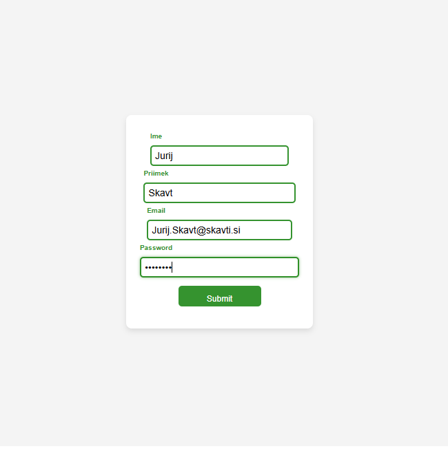
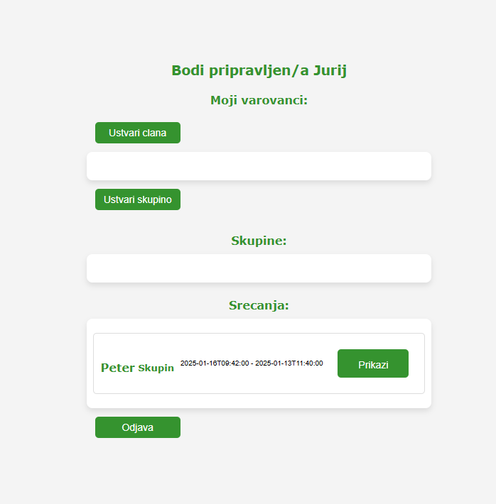
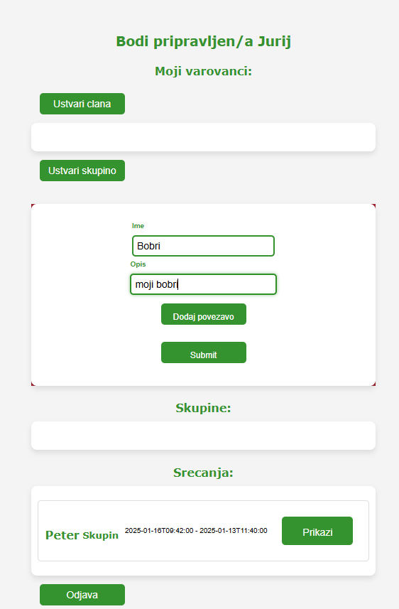
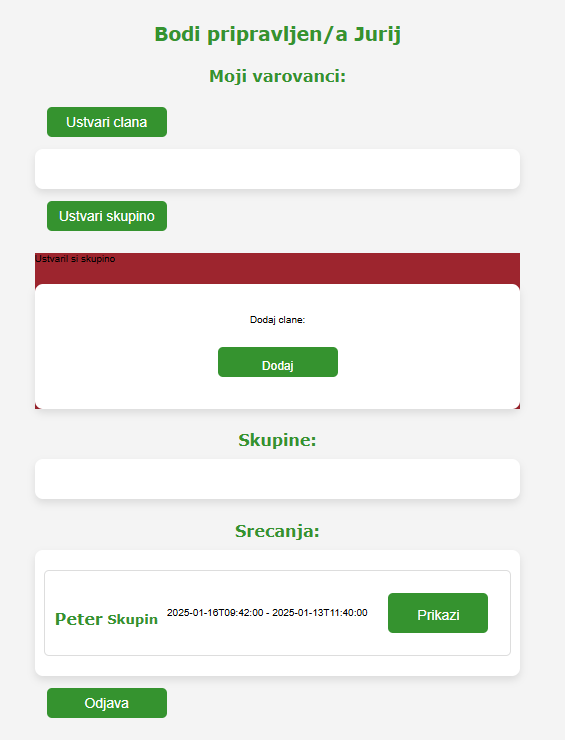
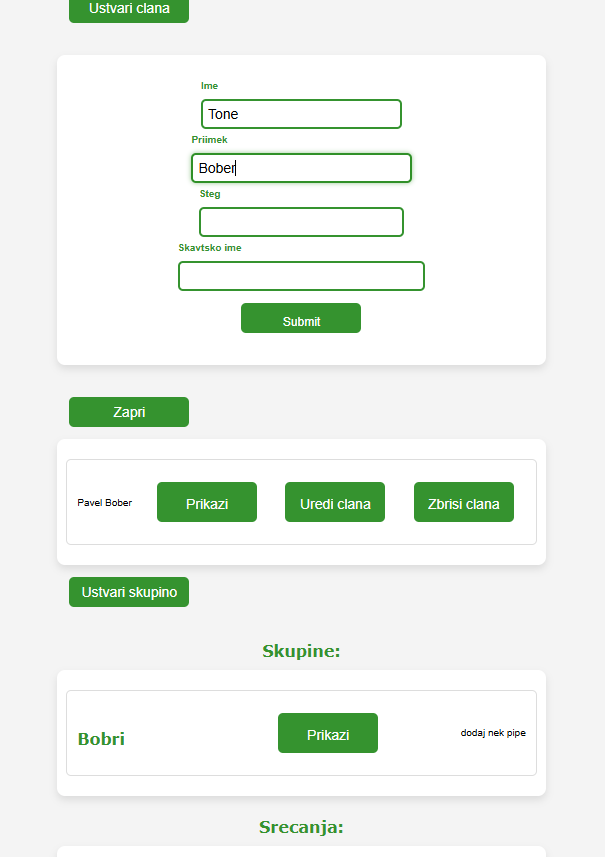
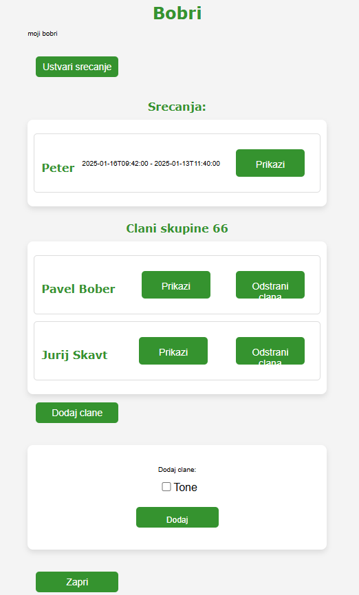
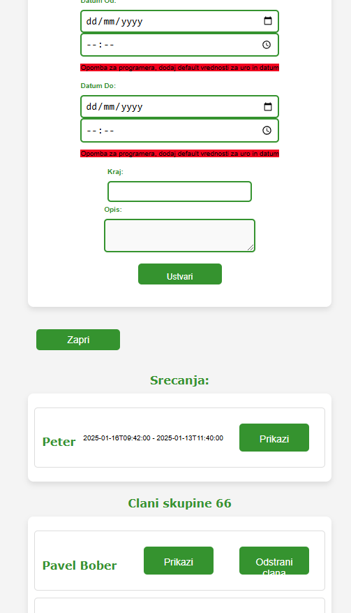
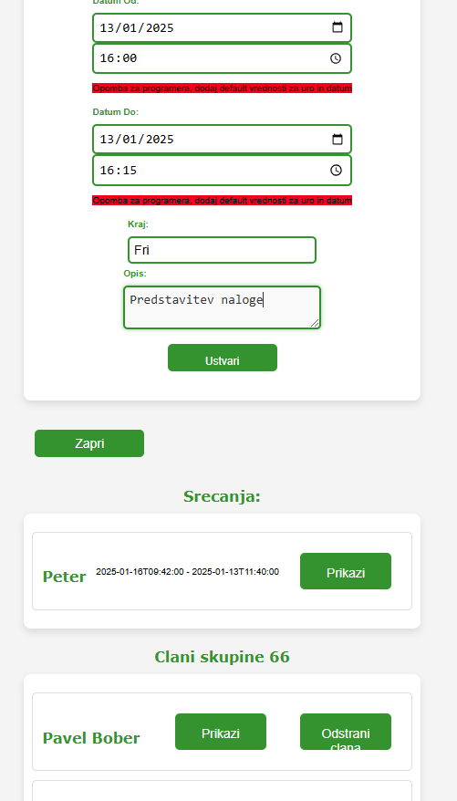
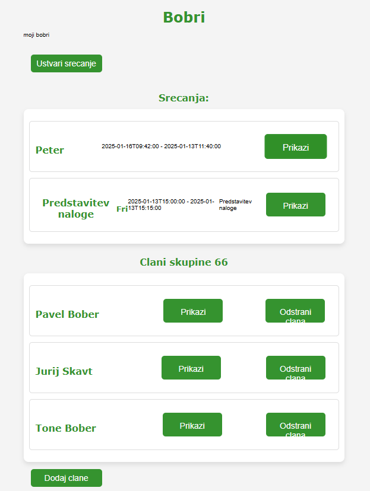

### Voditelj Jure si zabeleži, da je bober Tone opravil hlod

Jurij želi imeti nekje enostavno napisano kakšne hlode je bober Tone že opravil. Bobra Toneta že ima na seznamu svojih udeležencev, zato ga tam izbere. Izbere moznost, da doda zapis za osebno spremljanje. Vnese vse potrebne podatke in shrani zapis za osebno spremljanje, ki ga lahko berejo tudi ostali voditelji v skupini.
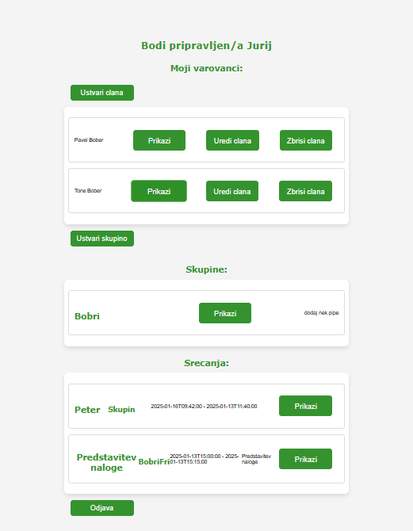
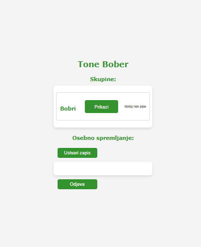
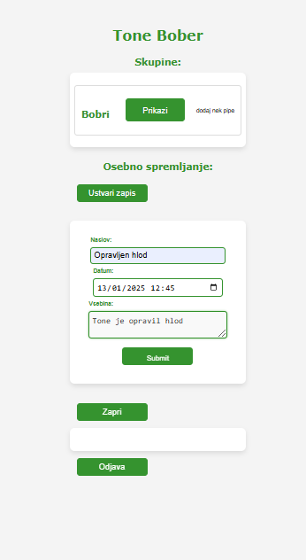
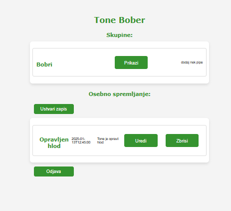

### Voditelj Jure zabeleži prisotnost bobrov na srečanju

Srečanje začne z beleženjem prisotnosti. Po pomoti je napisal, da je bil Pavel odsoten, ko se tega zave, popravi zapis in ga označi za prisotnega. Po nekaj časa se Tone odide s srečanja, zato Jurij to označi.
